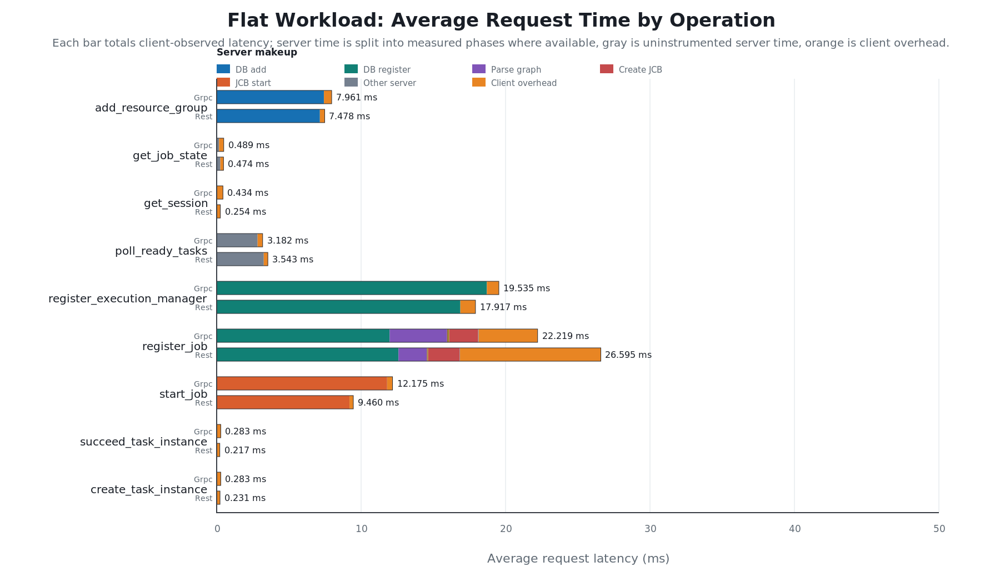
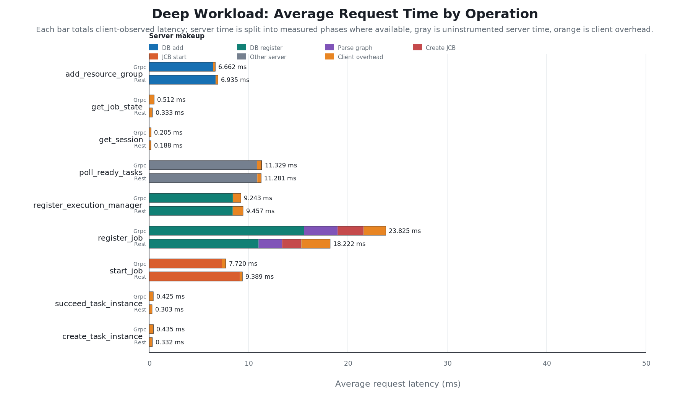
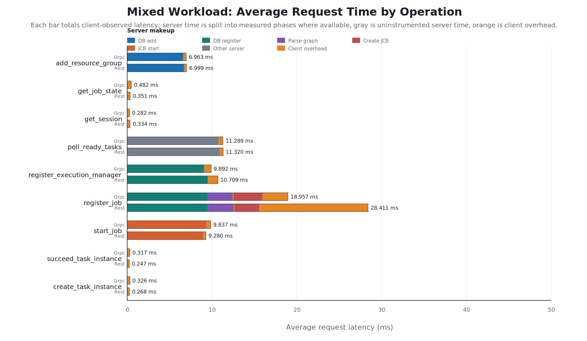

# Storage API Benchmark Report

This report compares gRPC and REST for storage API benchmark runs. Request averages are weighted by request count. In each chart, every request type is shown for one workload, with gRPC and REST side by side. Each bar totals client-observed average request latency. The server-side portion is split into measured phases where available; gray is server time not covered by a phase probe, and orange is client-side overhead.

## Setup

The storage API server ran on `baker3` at REST `http://10.1.0.3:8091` and gRPC `http://10.1.0.3:50051`; benchmark clients ran on `baker7`. Each run used `10` jobs, `1000` tasks per job, `128` byte payloads, `8` submit/monitor clients, `16` workers, `64` poll batch size, and `10` ms poll wait. The mixed workload used `80`% flat jobs and `20`% deep jobs.

## Request Latency Charts

The chart makeup is useful for diagnosing whether a protocol difference is really transport overhead or time spent inside a storage phase. For example, `register_job.db_register` is the database insert phase, while `start_job.jcb_start` is cache/JCB scheduling work rather than a database request.

### Flat

### Deep

### Mixed

## Overall Average Request Latency

| Workload | Protocol | Requests | Server avg (us) | Client overhead (us) | Client observed avg (us) | Client observed avg (ms) |
|---|---:|---:|---:|---:|---:|---:|
| flat | Grpc | 20,465 | 69.4 | 275.2 | 344.7 | 0.345 |
| flat | Rest | 20,415 | 73.1 | 218.6 | 291.7 | 0.292 |
| deep | Grpc | 40,504 | 4,124.7 | 454.1 | 4,578.8 | 4.579 |
| deep | Rest | 40,747 | 4,135.4 | 339.4 | 4,474.8 | 4.475 |
| mixed | Grpc | 28,452 | 2,791.8 | 368.4 | 3,160.3 | 3.160 |
| mixed | Rest | 30,002 | 3,187.3 | 310.2 | 3,497.4 | 3.497 |

## End-to-End Job Latency

| Workload | Protocol | Jobs | Failed jobs | p50 (ms) | p90 (ms) | p99 (ms) | max (ms) |
|---|---:|---:|---:|---:|---:|---:|---:|
| flat | Grpc | 10 | 0 | 303.448 | 317.019 | 317.019 | 317.019 |
| flat | Rest | 10 | 0 | 211.798 | 240.627 | 240.627 | 240.627 |
| deep | Grpc | 10 | 0 | 5,883.717 | 5,917.044 | 5,917.044 | 5,917.044 |
| deep | Rest | 10 | 0 | 6,210.172 | 6,278.860 | 6,278.860 | 6,278.860 |
| mixed | Grpc | 10 | 0 | 242.665 | 5,407.744 | 5,407.744 | 5,407.744 |
| mixed | Rest | 10 | 0 | 186.953 | 6,343.468 | 6,343.468 | 6,343.468 |

## Task Graph Upload Size

Bytes recorded per `register_job` call on the storage server. `Uncompressed` is the JSON encoding of the task graph; `Compressed` is what is bound to the `serialized_task_graph` column (zstd level 3). Ratio is `compressed / uncompressed`.

### Compression Ratio

| Workload | Protocol | Operation | Count | Uncompressed avg (B) | Compressed avg (B) | Ratio |
|---|---:|---|---:|---:|---:|---:|
| flat | Grpc | `register_job.job_inputs` | 10 | 145,003 | 52 | 0.000 |
| flat | Grpc | `register_job.task_graph` | 10 | 162,075 | 186 | 0.001 |
| flat | Rest | `register_job.job_inputs` | 10 | 145,003 | 52 | 0.000 |
| flat | Rest | `register_job.task_graph` | 10 | 162,075 | 186 | 0.001 |
| deep | Grpc | `register_job.job_inputs` | 10 | 146 | 34 | 0.233 |
| deep | Grpc | `register_job.task_graph` | 10 | 188,938 | 1,823 | 0.010 |
| deep | Rest | `register_job.job_inputs` | 10 | 146 | 34 | 0.233 |
| deep | Rest | `register_job.task_graph` | 10 | 188,938 | 1,823 | 0.010 |
| mixed | Grpc | `register_job.job_inputs` | 10 | 116,031 | 48 | 0.000 |
| mixed | Grpc | `register_job.task_graph` | 10 | 167,447 | 513 | 0.003 |
| mixed | Rest | `register_job.job_inputs` | 10 | 116,031 | 48 | 0.000 |
| mixed | Rest | `register_job.task_graph` | 10 | 167,447 | 513 | 0.003 |

### Per-Operation Size Detail

| Workload | Protocol | Operation | Count | avg (B) | p50 (B) | p99 (B) | max (B) | total (B) |
|---|---:|---|---:|---:|---:|---:|---:|---:|
| flat | Grpc | `register_job.job_inputs_compressed_bytes` | 10 | 52 | 52 | 52 | 52 | 520 |
| flat | Rest | `register_job.job_inputs_compressed_bytes` | 10 | 52 | 52 | 52 | 52 | 520 |
| flat | Grpc | `register_job.job_inputs_uncompressed_bytes` | 10 | 145,003 | 145,003 | 145,003 | 145,003 | 1,450,030 |
| flat | Rest | `register_job.job_inputs_uncompressed_bytes` | 10 | 145,003 | 145,003 | 145,003 | 145,003 | 1,450,030 |
| flat | Grpc | `register_job.task_graph_compressed_bytes` | 10 | 186 | 186 | 186 | 186 | 1,860 |
| flat | Rest | `register_job.task_graph_compressed_bytes` | 10 | 186 | 186 | 186 | 186 | 1,860 |
| flat | Grpc | `register_job.task_graph_uncompressed_bytes` | 10 | 162,075 | 162,075 | 162,075 | 162,075 | 1,620,750 |
| flat | Rest | `register_job.task_graph_uncompressed_bytes` | 10 | 162,075 | 162,075 | 162,075 | 162,075 | 1,620,750 |
| deep | Grpc | `register_job.job_inputs_compressed_bytes` | 10 | 34 | 34 | 34 | 34 | 340 |
| deep | Rest | `register_job.job_inputs_compressed_bytes` | 10 | 34 | 34 | 34 | 34 | 340 |
| deep | Grpc | `register_job.job_inputs_uncompressed_bytes` | 10 | 146 | 146 | 146 | 146 | 1,460 |
| deep | Rest | `register_job.job_inputs_uncompressed_bytes` | 10 | 146 | 146 | 146 | 146 | 1,460 |
| deep | Grpc | `register_job.task_graph_compressed_bytes` | 10 | 1,823 | 1,823 | 1,823 | 1,823 | 18,230 |
| deep | Rest | `register_job.task_graph_compressed_bytes` | 10 | 1,823 | 1,823 | 1,823 | 1,823 | 18,230 |
| deep | Grpc | `register_job.task_graph_uncompressed_bytes` | 10 | 188,938 | 188,938 | 188,938 | 188,938 | 1,889,380 |
| deep | Rest | `register_job.task_graph_uncompressed_bytes` | 10 | 188,938 | 188,938 | 188,938 | 188,938 | 1,889,380 |
| mixed | Grpc | `register_job.job_inputs_compressed_bytes` | 10 | 48 | 52 | 52 | 52 | 484 |
| mixed | Rest | `register_job.job_inputs_compressed_bytes` | 10 | 48 | 52 | 52 | 52 | 484 |
| mixed | Grpc | `register_job.job_inputs_uncompressed_bytes` | 10 | 116,031 | 145,003 | 145,003 | 145,003 | 1,160,316 |
| mixed | Rest | `register_job.job_inputs_uncompressed_bytes` | 10 | 116,031 | 145,003 | 145,003 | 145,003 | 1,160,316 |
| mixed | Grpc | `register_job.task_graph_compressed_bytes` | 10 | 513 | 186 | 1,823 | 1,823 | 5,134 |
| mixed | Rest | `register_job.task_graph_compressed_bytes` | 10 | 513 | 186 | 1,823 | 1,823 | 5,134 |
| mixed | Grpc | `register_job.task_graph_uncompressed_bytes` | 10 | 167,447 | 162,075 | 188,938 | 188,938 | 1,674,476 |
| mixed | Rest | `register_job.task_graph_uncompressed_bytes` | 10 | 167,447 | 162,075 | 188,938 | 188,938 | 1,674,476 |

## Request Latency Detail

| Workload | Request | Protocol | Count | Server avg (us) | Client overhead (us) | Client observed avg (us) |
|---|---|---:|---:|---:|---:|---:|
| flat | `add_resource_group` | Grpc | 1 | 7,426.0 | 535.0 | 7,961.0 |
| flat | `add_resource_group` | Rest | 1 | 7,149.0 | 329.0 | 7,478.0 |
| flat | `get_job_state` | Grpc | 234 | 163.0 | 326.0 | 489.0 |
| flat | `get_job_state` | Rest | 168 | 253.0 | 221.0 | 474.0 |
| flat | `get_session` | Grpc | 1 | 0.0 | 434.0 | 434.0 |
| flat | `get_session` | Rest | 1 | 0.0 | 254.0 | 254.0 |
| flat | `poll_ready_tasks` | Grpc | 193 | 2,833.0 | 349.0 | 3,182.0 |
| flat | `poll_ready_tasks` | Rest | 209 | 3,260.0 | 283.0 | 3,543.0 |
| flat | `register_execution_manager` | Grpc | 16 | 18,709.0 | 826.0 | 19,535.0 |
| flat | `register_execution_manager` | Rest | 16 | 16,872.0 | 1,045.0 | 17,917.0 |
| flat | `register_job` | Grpc | 10 | 18,142.0 | 4,077.0 | 22,219.0 |
| flat | `register_job` | Rest | 10 | 16,846.0 | 9,749.0 | 26,595.0 |
| flat | `start_job` | Grpc | 10 | 11,805.0 | 370.0 | 12,175.0 |
| flat | `start_job` | Rest | 10 | 9,196.0 | 264.0 | 9,460.0 |
| flat | `succeed_task_instance` | Grpc | 10,000 | 12.0 | 271.0 | 283.0 |
| flat | `succeed_task_instance` | Rest | 10,000 | 11.0 | 206.0 | 217.0 |
| flat | `create_task_instance` | Grpc | 10,000 | 11.0 | 272.0 | 283.0 |
| flat | `create_task_instance` | Rest | 10,000 | 12.0 | 219.0 | 231.0 |
| deep | `add_resource_group` | Grpc | 1 | 6,427.0 | 235.0 | 6,662.0 |
| deep | `add_resource_group` | Rest | 1 | 6,692.0 | 243.0 | 6,935.0 |
| deep | `get_job_state` | Grpc | 5,128 | 7.0 | 505.0 | 512.0 |
| deep | `get_job_state` | Rest | 5,304 | 6.0 | 327.0 | 333.0 |
| deep | `get_session` | Grpc | 1 | 0.0 | 205.0 | 205.0 |
| deep | `get_session` | Rest | 1 | 0.0 | 188.0 | 188.0 |
| deep | `poll_ready_tasks` | Grpc | 15,338 | 10,845.0 | 484.0 | 11,329.0 |
| deep | `poll_ready_tasks` | Rest | 15,405 | 10,897.0 | 384.0 | 11,281.0 |
| deep | `register_execution_manager` | Grpc | 16 | 8,422.0 | 821.0 | 9,243.0 |
| deep | `register_execution_manager` | Rest | 16 | 8,416.0 | 1,041.0 | 9,457.0 |
| deep | `register_job` | Grpc | 10 | 21,594.0 | 2,231.0 | 23,825.0 |
| deep | `register_job` | Rest | 10 | 15,329.0 | 2,893.0 | 18,222.0 |
| deep | `start_job` | Grpc | 10 | 7,333.0 | 387.0 | 7,720.0 |
| deep | `start_job` | Rest | 10 | 9,138.0 | 251.0 | 9,389.0 |
| deep | `succeed_task_instance` | Grpc | 10,000 | 16.0 | 409.0 | 425.0 |
| deep | `succeed_task_instance` | Rest | 10,000 | 14.0 | 289.0 | 303.0 |
| deep | `create_task_instance` | Grpc | 10,000 | 10.0 | 425.0 | 435.0 |
| deep | `create_task_instance` | Rest | 10,000 | 8.0 | 324.0 | 332.0 |
| mixed | `add_resource_group` | Grpc | 1 | 6,609.0 | 354.0 | 6,963.0 |
| mixed | `add_resource_group` | Rest | 1 | 6,724.0 | 275.0 | 6,999.0 |
| mixed | `get_job_state` | Grpc | 1,106 | 32.0 | 450.0 | 482.0 |
| mixed | `get_job_state` | Rest | 1,237 | 19.0 | 332.0 | 351.0 |
| mixed | `get_session` | Grpc | 1 | 0.0 | 282.0 | 282.0 |
| mixed | `get_session` | Rest | 1 | 0.0 | 334.0 | 334.0 |
| mixed | `poll_ready_tasks` | Grpc | 7,308 | 10,779.0 | 510.0 | 11,289.0 |
| mixed | `poll_ready_tasks` | Rest | 8,727 | 10,883.0 | 437.0 | 11,320.0 |
| mixed | `register_execution_manager` | Grpc | 16 | 9,093.0 | 799.0 | 9,892.0 |
| mixed | `register_execution_manager` | Rest | 16 | 9,522.0 | 1,187.0 | 10,709.0 |
| mixed | `register_job` | Grpc | 10 | 15,960.0 | 2,997.0 | 18,957.0 |
| mixed | `register_job` | Rest | 10 | 15,572.0 | 12,839.0 | 28,411.0 |
| mixed | `start_job` | Grpc | 10 | 9,359.0 | 478.0 | 9,837.0 |
| mixed | `start_job` | Rest | 10 | 8,991.0 | 289.0 | 9,280.0 |
| mixed | `succeed_task_instance` | Grpc | 10,000 | 12.0 | 305.0 | 317.0 |
| mixed | `succeed_task_instance` | Rest | 10,000 | 12.0 | 235.0 | 247.0 |
| mixed | `create_task_instance` | Grpc | 10,000 | 10.0 | 316.0 | 326.0 |
| mixed | `create_task_instance` | Rest | 10,000 | 10.0 | 258.0 | 268.0 |

## Server Phase Timing Detail

| Workload | Phase | Protocol | Count | Server avg (us) |
|---|---|---:|---:|---:|
| flat | `add_resource_group.db_add` | Grpc | 1 | 7,422.0 |
| flat | `add_resource_group.db_add` | Rest | 1 | 7,145.0 |
| flat | `register_execution_manager.db_register` | Grpc | 16 | 18,707.0 |
| flat | `register_execution_manager.db_register` | Rest | 16 | 16,870.0 |
| flat | `register_job.cache_insert` | Grpc | 10 | 0.0 |
| flat | `register_job.cache_insert` | Rest | 10 | 0.0 |
| flat | `register_job.create_jcb` | Grpc | 10 | 2,005.0 |
| flat | `register_job.create_jcb` | Rest | 10 | 2,184.0 |
| flat | `register_job.db_register` | Grpc | 10 | 11,979.0 |
| flat | `register_job.db_register` | Rest | 10 | 12,589.0 |
| flat | `register_job.parse_graph` | Grpc | 10 | 3,970.0 |
| flat | `register_job.parse_graph` | Rest | 10 | 1,960.0 |
| flat | `register_job.unframe_inputs` | Grpc | 10 | 87.0 |
| flat | `register_job.unframe_inputs` | Rest | 10 | 58.0 |
| flat | `register_job.validate` | Grpc | 10 | 63.0 |
| flat | `register_job.validate` | Rest | 10 | 35.0 |
| flat | `start_job.cache_get` | Grpc | 10 | 0.0 |
| flat | `start_job.cache_get` | Rest | 10 | 0.0 |
| flat | `start_job.jcb_start` | Grpc | 10 | 11,800.0 |
| flat | `start_job.jcb_start` | Rest | 10 | 9,192.0 |
| deep | `add_resource_group.db_add` | Grpc | 1 | 6,425.0 |
| deep | `add_resource_group.db_add` | Rest | 1 | 6,690.0 |
| deep | `register_execution_manager.db_register` | Grpc | 16 | 8,420.0 |
| deep | `register_execution_manager.db_register` | Rest | 16 | 8,414.0 |
| deep | `register_job.cache_insert` | Grpc | 10 | 0.0 |
| deep | `register_job.cache_insert` | Rest | 10 | 0.0 |
| deep | `register_job.create_jcb` | Grpc | 10 | 2,601.0 |
| deep | `register_job.create_jcb` | Rest | 10 | 1,911.0 |
| deep | `register_job.db_register` | Grpc | 10 | 15,601.0 |
| deep | `register_job.db_register` | Rest | 10 | 11,021.0 |
| deep | `register_job.parse_graph` | Grpc | 10 | 3,368.0 |
| deep | `register_job.parse_graph` | Rest | 10 | 2,370.0 |
| deep | `register_job.unframe_inputs` | Grpc | 10 | 0.0 |
| deep | `register_job.unframe_inputs` | Rest | 10 | 0.0 |
| deep | `register_job.validate` | Grpc | 10 | 4.0 |
| deep | `register_job.validate` | Rest | 10 | 4.0 |
| deep | `start_job.cache_get` | Grpc | 10 | 0.0 |
| deep | `start_job.cache_get` | Rest | 10 | 0.0 |
| deep | `start_job.jcb_start` | Grpc | 10 | 7,328.0 |
| deep | `start_job.jcb_start` | Rest | 10 | 9,134.0 |
| mixed | `add_resource_group.db_add` | Grpc | 1 | 6,606.0 |
| mixed | `add_resource_group.db_add` | Rest | 1 | 6,720.0 |
| mixed | `register_execution_manager.db_register` | Grpc | 16 | 9,090.0 |
| mixed | `register_execution_manager.db_register` | Rest | 16 | 9,519.0 |
| mixed | `register_job.cache_insert` | Grpc | 10 | 0.0 |
| mixed | `register_job.cache_insert` | Rest | 10 | 0.0 |
| mixed | `register_job.create_jcb` | Grpc | 10 | 3,395.0 |
| mixed | `register_job.create_jcb` | Rest | 10 | 2,879.0 |
| mixed | `register_job.db_register` | Grpc | 10 | 9,462.0 |
| mixed | `register_job.db_register` | Rest | 10 | 9,510.0 |
| mixed | `register_job.parse_graph` | Grpc | 10 | 2,912.0 |
| mixed | `register_job.parse_graph` | Rest | 10 | 2,979.0 |
| mixed | `register_job.unframe_inputs` | Grpc | 10 | 99.0 |
| mixed | `register_job.unframe_inputs` | Rest | 10 | 100.0 |
| mixed | `register_job.validate` | Grpc | 10 | 50.0 |
| mixed | `register_job.validate` | Rest | 10 | 70.0 |
| mixed | `start_job.cache_get` | Grpc | 10 | 0.0 |
| mixed | `start_job.cache_get` | Rest | 10 | 0.0 |
| mixed | `start_job.jcb_start` | Grpc | 10 | 9,355.0 |
| mixed | `start_job.jcb_start` | Rest | 10 | 8,987.0 |

## Detailed Findings

- `flat`: REST has lower weighted average request latency (0.345 ms gRPC vs 0.292 ms REST). REST has lower p50 e2e job latency (303.448 ms gRPC vs 211.798 ms REST).
- `deep`: REST has lower weighted average request latency (4.579 ms gRPC vs 4.475 ms REST). gRPC has lower p50 e2e job latency (5,883.717 ms gRPC vs 6,210.172 ms REST).
- `mixed`: gRPC has lower weighted average request latency (3.160 ms gRPC vs 3.497 ms REST). REST has lower p50 e2e job latency (242.665 ms gRPC vs 186.953 ms REST).

- For flat `register_job`, most server-side time is in `register_job.db_register` (11.979 ms gRPC, 12.589 ms REST). This points at database insert/pool behavior rather than graph parsing, validation, or cache insertion.
- `flat` `start_job` is almost entirely `start_job.jcb_start`; `start_job.cache_get` is near zero. The JCB start phase is 11.800 ms for gRPC and 9.192 ms for REST.
- `deep` `start_job` is almost entirely `start_job.jcb_start`; `start_job.cache_get` is near zero. The JCB start phase is 7.328 ms for gRPC and 9.134 ms for REST.
- `mixed` `start_job` is almost entirely `start_job.jcb_start`; `start_job.cache_get` is near zero. The JCB start phase is 9.355 ms for gRPC and 8.987 ms for REST.
- `register_job.cache_insert`, `register_job.validate`, and `start_job.cache_get` are consistently tiny. They are unlikely to explain the protocol differences.
- The main remaining suspects are database insert/pool behavior for DB-backed operations and JCB start scheduling for `start_job`. The charts now separate those paths so the next benchmark run can confirm whether the gRPC/REST gap is coming from DB registration or non-DB scheduling.

## Protocol Summary

| Workload | Faster by avg request latency | gRPC avg request (ms) | REST avg request (ms) | Faster by e2e p50 | gRPC e2e p50 (ms) | REST e2e p50 (ms) |
|---|---:|---:|---:|---:|---:|---:|
| flat | REST | 0.345 | 0.292 | REST | 303.448 | 211.798 |
| deep | REST | 4.579 | 4.475 | gRPC | 5,883.717 | 6,210.172 |
| mixed | gRPC | 3.160 | 3.497 | REST | 242.665 | 186.953 |
